# Push_swap

A 42 School project that implements an efficient sorting algorithm using two stacks and a limited set of operations.

## Description

Push_swap is a sorting algorithm project where you must sort a stack of integers using the smallest number of operations possible. The program uses two stacks (A and B) and a limited set of operations to achieve optimal sorting.

**Key Features:**

- Sorts integers in ascending order
- Uses two stacks with specific operations
- Optimized for minimal number of moves
- Handles edge cases and error validation
- Includes a checker program for verification

## Algorithm

The implementation uses a sophisticated sorting strategy based on stack size:

```mermaid
flowchart TD
    A[Input: Unsorted Stack A] --> B{Stack Size?}

    B -->|2 elements| C[Check if first > second<br/>If yes: sa]
    B -->|3 elements| D[tiny_sort Algorithm:<br/>Find highest node<br/>Position it correctly<br/>Final sa if needed]
    B -->|4-5 elements| E[handle_five Algorithm]
    B -->|6+ elements| F[Advanced Sorting Algorithm]

    C --> END[✅ Sorted!]
    D --> END

    E --> G[Step 1: Find 2 smallest numbers]
    G --> H[Step 2: Push smallest to B using rotations]
    H --> I[Step 3: Push 2nd smallest to B]
    I --> J[Step 4: Sort remaining 3 in A using tiny_sort]
    J --> K[Step 5: Push back from B in correct order]
    K --> END

    F --> L[Step 1: Push all but 3 elements to B]
    L --> M[Step 2: Sort remaining 3 in A]
    M --> N{Is B empty?}
    N -->|No| O[Step 3: For each node in B:<br/>• Set current position<br/>• Find target in A<br/>• Calculate rotation costs<br/>• Mark cheapest node]
    O --> P[Step 4: Move cheapest node<br/>• Rotate both stacks optimally<br/>• Push to A]
    P --> N
    N -->|Yes| Q[Step 5: Final rotation<br/>Put smallest element on top]
    Q --> END

    %% Modern color scheme
    style A fill:#667eea,stroke:#764ba2,stroke-width:3px,color:#fff
    style B fill:#f093fb,stroke:#f5576c,stroke-width:2px,color:#fff
    style C fill:#4facfe,stroke:#00f2fe,stroke-width:2px,color:#fff
    style D fill:#43e97b,stroke:#38f9d7,stroke-width:2px,color:#fff
    style E fill:#fa709a,stroke:#fee140,stroke-width:2px,color:#fff
    style F fill:#a8edea,stroke:#fed6e3,stroke-width:2px,color:#333
    style END fill:#d299c2,stroke:#fef9d7,stroke-width:3px,color:#333

    %% Handle five steps
    style G fill:#ffecd2,stroke:#fcb69f,stroke-width:2px,color:#333
    style H fill:#ffecd2,stroke:#fcb69f,stroke-width:2px,color:#333
    style I fill:#ffecd2,stroke:#fcb69f,stroke-width:2px,color:#333
    style J fill:#ffecd2,stroke:#fcb69f,stroke-width:2px,color:#333
    style K fill:#ffecd2,stroke:#fcb69f,stroke-width:2px,color:#333

    %% Advanced algorithm steps
    style L fill:#a8e6cf,stroke:#dcedc1,stroke-width:2px,color:#333
    style M fill:#a8e6cf,stroke:#dcedc1,stroke-width:2px,color:#333
    style N fill:#ff8a80,stroke:#ffccbc,stroke-width:2px,color:#333
    style O fill:#a8e6cf,stroke:#dcedc1,stroke-width:2px,color:#333
    style P fill:#a8e6cf,stroke:#dcedc1,stroke-width:2px,color:#333
    style Q fill:#a8e6cf,stroke:#dcedc1,stroke-width:2px,color:#333
```



### Small Stacks (2-3 elements)

#### 2 Elements Strategy

- Check if first > second
- If yes: execute `sa` (swap a)
- Maximum operations: 1

#### 3 Elements Strategy (tiny_sort)

- Find the highest value among the 3 elements
- Position highest optimally using rotations
- Apply `sa` if needed for final order
- Maximum operations: 3

### Medium Stacks (4-5 elements)

#### handle_five Algorithm

Uses a three-phase approach:

1. **Reduce Phase**: Push 2 smallest elements to stack B
2. **Sort Phase**: Apply tiny_sort to remaining 3 elements in stack A
3. **Reintegrate Phase**: Push elements back from B in correct order

Maximum operations: 12

### Large Stacks (6+ elements)

#### Advanced Algorithm with Cost Analysis

The algorithm uses a five-phase approach:

1. **Preparation**: Push all but 3 elements to stack B
2. **Base Sort**: Sort remaining 3 elements using tiny_sort
3. **Cost Calculation**: Calculate movement costs for each element in B
4. **Optimal Movement**: Move cheapest elements first
5. **Final Position**: Rotate to put smallest element on top

#### Cost Optimization

- Considers rotation costs for both stacks
- Uses simultaneous rotations when beneficial
- Employs median-based positioning strategy
- Dynamically recalculates costs after each move

## Installation

```bash
# Clone the repository
git clone <your-repo-url>
cd push_swap

# Compile push_swap
make -C push_swap

# Compile checker (optional)
make -C checker
```

## Usage

### Basic Usage

```bash
# Sort a list of integers
./push_swap/push_swap 4 67 3 87 23

# Using quoted string (single argument)
./push_swap/push_swap "4 67 3 87 23"
```

### With Checker

```bash
# Generate moves and verify with checker
./push_swap/push_swap 4 67 3 87 23 | ./checker/checker 4 67 3 87 23

# Count number of operations
./push_swap/push_swap 4 67 3 87 23 | wc -l
```

## Operations

The program uses the following operations:

| Operation | Description                                 |
| --------- | ------------------------------------------- |
| `sa`      | Swap first 2 elements of stack A            |
| `sb`      | Swap first 2 elements of stack B            |
| `ss`      | Swap first 2 elements of both stacks        |
| `pa`      | Push top element from B to A                |
| `pb`      | Push top element from A to B                |
| `ra`      | Rotate stack A (move top to bottom)         |
| `rb`      | Rotate stack B (move top to bottom)         |
| `rr`      | Rotate both stacks                          |
| `rra`     | Reverse rotate stack A (move bottom to top) |
| `rrb`     | Reverse rotate stack B (move bottom to top) |
| `rrr`     | Reverse rotate both stacks                  |

## Project Structure

```
push_swap/
├── 📁 checker/
│   ├── 🔧 Makefile
│   ├── 📄 checker.c          # Main checker program
│   ├── 📄 checker.h          # Checker header
│   ├── 📄 get_next_line.c    # Read operations from stdin
│   ├── 📄 get_next_line.h
│   └── 📄 get_next_line_utils.c
└── 📁 push_swap/
    ├── 🔧 Makefile
    ├── 📄 check_errors.c     # Error handling and validation
    ├── 📄 ft_split.c         # String splitting utility
    ├── 📄 main.c             # Main program entry
    ├── 📄 push.c             # Push operations (pa, pb)
    ├── 📄 push_swap.h        # Main header file
    ├── 📄 push_swap_init.c   # Node initialization functions
    ├── 📄 push_swapp.c       # Main sorting algorithm
    ├── 📄 reverse_rotate.c   # Reverse rotation operations
    ├── 📄 rotate.c           # Rotation operations
    ├── 📄 stack_init.c       # Stack initialization
    ├── 📄 stack_sorted.c     # Check if stack is sorted
    ├── 📄 stack_utils.c      # Stack utility functions
    ├── 📄 swap.c             # Swap operations
    └── 📄 tiny_sort.c        # Optimized sorting for small stacks
```

### Key Components

- **Stack Structure**: Doubly linked list with additional metadata
- **Error Handling**: Comprehensive input validation
- **Memory Management**: Proper allocation and deallocation
- **Optimization**: Cost-based decision making for large stacks

## Checker Program

The checker program verifies if a sequence of operations correctly sorts the stack:

```bash
# Manual verification
echo -e "pb\nra\nsa\npa" | ./checker/checker 3 2 1

# Automated verification
./push_swap/push_swap 3 2 1 | ./checker/checker 3 2 1
```

**Output:**

- `OK` - Stack is correctly sorted
- `KO` - Stack is not sorted or operations are invalid
- `Error` - Invalid input or operations

## Performance

The algorithm aims for optimal performance with the following benchmarks:

| Elements | Target Operations | Max Operations | Grade |
| -------- | ----------------- | -------------- | ----- |
| 3        | ≤ 3               | 3              | ✅    |
| 5        | ≤ 12              | 12             | ✅    |
| 100      | ~500              | 700            | 🏆    |
| 500      | ~3500             | 5500           | 🏆    |

### Performance Visualization

```
Operations Count by Input Size:

    3 elements:  ███ (≤3 ops)
    5 elements:  ████████████ (≤12 ops)
   100 elements: ████████████████████████████████████████████████████ (~500 ops)
   500 elements: ████████████████████████████████████████████████████████████████████████████████████████████████████████████████████████████████████████████████████████████████████████████████████████████████████████████████████████████████████████████████████████████████████████████████████████████████████████████████████████████████████████████ (~3500 ops)
```

## Examples

### Visual Sorting Process

```
INITIAL STATE:
Stack A: [4, 67, 3, 87, 23]    Stack B: []
         ↑ top

STEP 1 - pb (push 4 to B):
Stack A: [67, 3, 87, 23]       Stack B: [4]
         ↑ top                          ↑ top

STEP 2 - pb (push 67 to B):
Stack A: [3, 87, 23]           Stack B: [67, 4]
         ↑ top                          ↑ top

STEP 3 - ra (rotate A):
Stack A: [87, 23, 3]           Stack B: [67, 4]
         ↑ top                          ↑ top

STEP 4 - pa (push 67 back to A):
Stack A: [67, 87, 23, 3]       Stack B: [4]
         ↑ top                          ↑ top

FINAL STATE:
Stack A: [3, 4, 23, 67, 87]    Stack B: []
         ↑ top (sorted!)
```

### Example 1: Small Stack

```bash
$ ./push_swap/push_swap 3 1 2
sa
ra
```

### Example 2: Larger Stack

```bash
$ ./push_swap/push_swap 5 4 3 2 1
pb
pb
sa
pa
ra
pa
```

### Example 3: With Verification

```bash
$ ./push_swap/push_swap 4 67 3 87 23 | ./checker/checker 4 67 3 87 23
OK
```

### Example 4: Operation Count

```bash
$ ./push_swap/push_swap 5 4 3 2 1 | wc -l
6

$ ./push_swap/push_swap 1 2 3 4 5
# No output - already sorted!
```

## Error Handling

The program handles various error cases with comprehensive validation:

### Error Cases Visualization

```bash
# ✅ Valid input - sorted output
$ ./push_swap/push_swap 3 1 2
sa
ra

# ❌ Non-numeric arguments
$ ./push_swap/push_swap 1 2 abc
Error

# ❌ Duplicate numbers
$ ./push_swap/push_swap 1 2 2 3
Error

# ❌ Integer overflow
$ ./push_swap/push_swap 1 2147483648
Error

# ❌ Invalid syntax (empty argument)
$ ./push_swap/push_swap 1 "" 3
Error

# ❌ Invalid operations (checker)
$ echo "invalid_op" | ./checker/checker 1 2 3
Error

# ✅ Already sorted - no operations needed
$ ./push_swap/push_swap 1 2 3 4 5
# (no output)

# ✅ Single element - no operations needed
$ ./push_swap/push_swap 42
# (no output)
```

### Error Types Summary

| Error Type       | Example                     | Output          |
| ---------------- | --------------------------- | --------------- |
| **Syntax Error** | `push_swap 1 2a 3`          | `Error`         |
| **Duplicate**    | `push_swap 1 2 1`           | `Error`         |
| **Overflow**     | `push_swap 999999999999`    | `Error`         |
| **Invalid Op**   | `echo "xyz" \| checker 1 2` | `Error`         |
| **Valid Input**  | `push_swap 3 2 1`           | Operations list |

## Technical Details

### Data Structure

```c
typedef struct s_stack_node
{
    int value;                    // The integer value
    int current_position;         // Position in stack
    int final_index;             // Target position
    int push_price;              // Cost to move element
    bool above_median;           // Position relative to median
    bool cheapest;               // Is this the cheapest to move
    struct s_stack_node *target_node;  // Target position in other stack
    struct s_stack_node *next;
    struct s_stack_node *prev;
} t_stack_node;
```

### Algorithm Complexity

- **Time Complexity**: O(n²) for cost calculation, O(n log n) average case
- **Space Complexity**: O(n) for the two stacks
- **Optimizations**: Simultaneous rotations, median-based positioning

## Testing

### Automated Testing Script

The project includes a `test.sh` script for automated testing:

```bash
# Run the automated test script
./test.sh
```

This script:
1. Generates 500 unique random numbers (1-10000) and saves them to `numbers.txt`
2. Runs `push_swap` on these numbers and saves the output moves to `instruction.txt`

**Files created:**
- `numbers.txt` - Contains the 500 random numbers used for testing
- `instruction.txt` - Contains the sorting operations generated by push_swap

### Visualizer Integration

The generated files can be used with online push_swap visualizers:

```bash
# Run test script to generate files
./test.sh

# Copy the files to use with online visualizers:
cat numbers.txt    # Copy these numbers to visualizer input
cat instruction.txt # Copy these operations to visualizer
```

**Visualizer Usage:**
- `numbers.txt` - Copy the numbers to use as input for the online visualizer
- `instruction.txt` - Copy the operations sequence to visualize the sorting process

You can paste these contents into any push_swap visualizer website to see your algorithm in action!

### Quick Test Commands

```bash
# Test with random numbers and count operations
ARG=$(ruby -e "puts (1..100).to_a.shuffle.join(' ')"); ./push_swap/push_swap $ARG | wc -l

# Test edge cases
./push_swap/push_swap 42
./push_swap/push_swap 1 2 3 4 5
./push_swap/push_swap 5 4 3 2 1

# Use the test script output for verification
./push_swap/push_swap $(cat numbers.txt) | ./checker/checker $(cat numbers.txt)
```

### Comprehensive Testing Suite

```bash
# Test 1: Already sorted
echo "Testing already sorted..."
./push_swap/push_swap 1 2 3 4 5 | wc -l  # Should output 0

# Test 2: Reverse sorted
echo "Testing reverse sorted..."
./push_swap/push_swap 5 4 3 2 1 | wc -l  # Should be minimal

# Test 3: Random 100 numbers
echo "Testing 100 random numbers..."
ARG=$(seq 1 100 | shuf | tr '\n' ' ')
OPS=$(./push_swap/push_swap $ARG | wc -l)
echo "Operations used: $OPS (target: <700)"

# Test 4: Verify correctness
echo "Testing correctness..."
ARG="4 67 3 87 23"
RESULT=$(./push_swap/push_swap $ARG | ./checker/checker $ARG)
echo "Result: $RESULT (should be OK)"

# Test 5: Error handling
echo "Testing error handling..."
./push_swap/push_swap 1 2 abc 2>/dev/null && echo "ERROR: Should have failed"
./push_swap/push_swap 1 2 2 2>/dev/null && echo "ERROR: Should have failed"
```

### Performance Testing Results

```
Test Results Summary:
┌─────────────┬─────────────┬─────────────┬──────────┐
│ Input Size  │ Operations  │ Target      │ Status   │
├─────────────┼─────────────┼─────────────┼──────────┤
│ 3 elements  │ ≤ 3         │ ≤ 3         │ ✅ PASS  │
│ 5 elements  │ ≤ 12        │ ≤ 12        │ ✅ PASS  │
│ 100 random  │ ~500        │ < 700       │ 🏆 EXCEL │
│ 500 random  │ ~3500       │ < 5500      │ 🏆 EXCEL │
└─────────────┴─────────────┴─────────────┴──────────┘
```

## Notes

- All operations are printed to stdout
- The program must handle both individual arguments and quoted strings
- Memory leaks are not tolerated
- The checker program uses `get_next_line` to read operations
- Error messages are written to stderr

## Learning Objectives

This project teaches:

- Algorithm optimization and complexity analysis
- Data structure manipulation (linked lists)
- Memory management in C
- Error handling and input validation
- Problem-solving with constraints

---

**Author**: bmezher  
**School**: 42 School  
**Project**: push_swap
