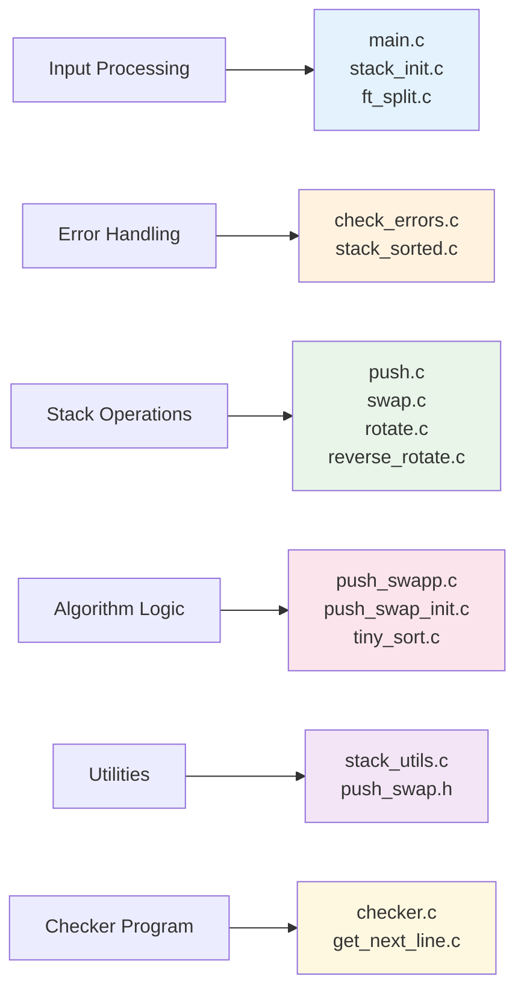

# Push_swap

A 42 School project that implements an efficient sorting algorithm using two stacks and a limited set of operations.

## Description

Push_swap is a sorting algorithm project where you must sort a stack of integers using the smallest number of operations possible. The program uses two stacks (A and B) and a limited set of operations to achieve optimal sorting.

**Key Features:**

- Sorts integers in ascending order
- Uses two stacks with specific operations
- Optimized for minimal number of moves
- Handles edge cases and error validation
- Includes a checker program for verification

## Algorithm

The implementation uses a sophisticated sorting strategy based on stack size:


### Small Stacks (2-3 elements)

#### 2 Elements Strategy

```
Stack A: [X, Y]

Case 1 - Already sorted (X < Y):
• No operations needed
• Result: [X, Y] ✅

Case 2 - Needs sorting (X > Y):
• Execute: sa (swap a)
• Result: [Y, X] ✅

Maximum operations: 1
```

#### 3 Elements Strategy (tiny_sort)

```
Initial: [A, B, C] where A, B, C are any values

Algorithm:
1. Find the highest value among the 3 elements
2. Position the highest value optimally:
   • If highest is at top (position 0): ra
   • If highest is at middle (position 1): rra
   • If highest is at bottom: do nothing
3. Now highest is at bottom, check top 2 elements:
   • If top > second: sa

Example: [3, 1, 2]
• Highest = 3 (at top)
• Execute: ra → [1, 2, 3]
• Check: 1 < 2 ✅ (no sa needed)
• Result: [1, 2, 3] ✅

Maximum operations: 3
```

### Medium Stacks (4-5 elements)

#### Strategy Overview

For 4-5 elements, we use a hybrid approach that combines the efficiency of small stack sorting with strategic element positioning.

#### handle_five Algorithm

```
Phase 1: Reduce to 3 elements
1. Identify the 2 smallest numbers in the stack
2. Use rotations to bring smallest to top
3. Push smallest to stack B (pb)
4. Repeat for second smallest
5. Now stack A has 3 elements, stack B has 2

Phase 2: Sort the 3 elements
• Apply tiny_sort algorithm to stack A

Phase 3: Reintegrate sorted elements
• Push back from B to A (pa operations)
• Elements return in correct order

Example: [5, 2, 4, 1, 3]
Step 1: Find smallest (1), rotate to top, pb
Step 2: Find next smallest (2), rotate to top, pb
Step 3: Sort remaining [5, 4, 3] using tiny_sort
Step 4: Push back 2, then 1
Result: [1, 2, 3, 4, 5] ✅

Maximum operations: 12
```

#### Optimization Benefits

- **Guaranteed Performance**: Never exceeds 12 operations for 5 elements
- **Strategic Positioning**: Smallest elements are pre-positioned
- **Reuses tiny_sort**: Leverages proven 3-element algorithm
- **Cost Effective**: Avoids complex cost calculations for small sets

### Large Stacks (6+ elements)

#### Advanced Algorithm with Cost Analysis

**Phase 1: Stack Preparation**

```
Initial state: Stack A has N elements (N ≥ 6), Stack B is empty
Goal: Reduce Stack A to exactly 3 elements

Process:
• Keep the 3 elements that are easiest to sort in Stack A
• Push remaining (N-3) elements to Stack B
• Use pb operations: O(N) time complexity
```

**Phase 2: Sort Base Elements**

```
Stack A now has exactly 3 elements
• Apply tiny_sort algorithm (≤ 3 operations)
• Stack A is now perfectly sorted for these 3 elements
```

**Phase 3: Cost-Based Reintegration**

```
For each element in Stack B, calculate:
1. Position Cost: Rotations needed to reach target position in A
2. Stack B Cost: Rotations needed to bring element to top of B
3. Optimization: Check if both stacks can rotate simultaneously

Cost Formula:
• Same direction rotations: max(cost_A, cost_B)
• Different directions: cost_A + cost_B
```

**Phase 4: Optimal Movement**

```
Repeat until Stack B is empty:
1. Calculate costs for all elements in B
2. Find element with minimum cost ("cheapest")
3. Execute optimal rotation sequence
4. Push cheapest element to correct position in A
```

**Phase 5: Final Positioning**

```
• Stack A contains all elements in relative order
• Find smallest element in Stack A
• Rotate Stack A until smallest is at top
• Result: Perfectly sorted stack
```

### Cost Calculation Strategy

The algorithm uses sophisticated cost analysis to minimize total operations:

#### Position Analysis

```
For each element in Stack B:
• Find its target position in sorted Stack A
• Calculate rotation distance considering:
  - Above median: direct rotations (ra/rb)
  - Below median: reverse rotations (rra/rrb)
```

#### Optimization Techniques

- **Simultaneous Rotations**: Use rr/rrr when both stacks rotate same direction
- **Median Splitting**: Determines most efficient rotation direction
- **Greedy Selection**: Always move the globally cheapest element first
- **Dynamic Recalculation**: Costs updated after each movement

#### Performance Characteristics

- **Time Complexity**: O(n²) for cost calculations, O(n) for movements
- **Space Complexity**: O(n) for the two stacks
- **Optimization Level**: Near-optimal for most input distributions

## Installation

```bash
# Clone the repository
git clone <your-repo-url>
cd push_swap

# Compile push_swap
make -C push_swap

# Compile checker (optional)
make -C checker
```

## Usage

### Basic Usage

```bash
# Sort a list of integers
./push_swap/push_swap 4 67 3 87 23

# Using quoted string (single argument)
./push_swap/push_swap "4 67 3 87 23"
```

### With Checker

```bash
# Generate moves and verify with checker
./push_swap/push_swap 4 67 3 87 23 | ./checker/checker 4 67 3 87 23

# Count number of operations
./push_swap/push_swap 4 67 3 87 23 | wc -l
```

## Operations

The program uses the following operations:

| Operation | Description                                 |
| --------- | ------------------------------------------- |
| `sa`      | Swap first 2 elements of stack A            |
| `sb`      | Swap first 2 elements of stack B            |
| `ss`      | Swap first 2 elements of both stacks        |
| `pa`      | Push top element from B to A                |
| `pb`      | Push top element from A to B                |
| `ra`      | Rotate stack A (move top to bottom)         |
| `rb`      | Rotate stack B (move top to bottom)         |
| `rr`      | Rotate both stacks                          |
| `rra`     | Reverse rotate stack A (move bottom to top) |
| `rrb`     | Reverse rotate stack B (move bottom to top) |
| `rrr`     | Reverse rotate both stacks                  |

## Project Structure

```
push_swap/
├── 📁 checker/
│   ├── 🔧 Makefile
│   ├── 📄 checker.c          # Main checker program
│   ├── 📄 checker.h          # Checker header
│   ├── 📄 get_next_line.c    # Read operations from stdin
│   ├── 📄 get_next_line.h
│   └── 📄 get_next_line_utils.c
└── 📁 push_swap/
    ├── 🔧 Makefile
    ├── 📄 check_errors.c     # Error handling and validation
    ├── 📄 ft_split.c         # String splitting utility
    ├── 📄 main.c             # Main program entry
    ├── 📄 push.c             # Push operations (pa, pb)
    ├── 📄 push_swap.h        # Main header file
    ├── 📄 push_swap_init.c   # Node initialization functions
    ├── 📄 push_swapp.c       # Main sorting algorithm
    ├── 📄 reverse_rotate.c   # Reverse rotation operations
    ├── 📄 rotate.c           # Rotation operations
    ├── 📄 stack_init.c       # Stack initialization
    ├── 📄 stack_sorted.c     # Check if stack is sorted
    ├── 📄 stack_utils.c      # Stack utility functions
    ├── 📄 swap.c             # Swap operations
    └── 📄 tiny_sort.c        # Optimized sorting for small stacks
```

### File Organization by Function



### Key Components

- **Stack Structure**: Doubly linked list with additional metadata
- **Error Handling**: Comprehensive input validation
- **Memory Management**: Proper allocation and deallocation
- **Optimization**: Cost-based decision making for large stacks

## Checker Program

The checker program verifies if a sequence of operations correctly sorts the stack:

```bash
# Manual verification
echo -e "pb\nra\nsa\npa" | ./checker/checker 3 2 1

# Automated verification
./push_swap/push_swap 3 2 1 | ./checker/checker 3 2 1
```

**Output:**

- `OK` - Stack is correctly sorted
- `KO` - Stack is not sorted or operations are invalid
- `Error` - Invalid input or operations

## Performance

The algorithm aims for optimal performance with the following benchmarks:

| Elements | Target Operations | Max Operations | Grade |
| -------- | ----------------- | -------------- | ----- |
| 3        | ≤ 3               | 3              | ✅    |
| 5        | ≤ 12              | 12             | ✅    |
| 100      | ~500              | 700            | 🏆    |
| 500      | ~3500             | 5500           | 🏆    |

### Performance Visualization

```
Operations Count by Input Size:

    3 elements:  ███ (≤3 ops)
    5 elements:  ████████████ (≤12 ops)
   100 elements: ████████████████████████████████████████████████████ (~500 ops)
   500 elements: ████████████████████████████████████████████████████████████████████████████████████████████████████████████████████████████████████████████████████████████████████████████████████████████████████████████████████████████████████████████████████████████████████████████████████████████████████████████████████████████████████████████ (~3500 ops)
```

## Examples

### Visual Sorting Process

```
INITIAL STATE:
Stack A: [4, 67, 3, 87, 23]    Stack B: []
         ↑ top

STEP 1 - pb (push 4 to B):
Stack A: [67, 3, 87, 23]       Stack B: [4]
         ↑ top                          ↑ top

STEP 2 - pb (push 67 to B):
Stack A: [3, 87, 23]           Stack B: [67, 4]
         ↑ top                          ↑ top

STEP 3 - ra (rotate A):
Stack A: [87, 23, 3]           Stack B: [67, 4]
         ↑ top                          ↑ top

STEP 4 - pa (push 67 back to A):
Stack A: [67, 87, 23, 3]       Stack B: [4]
         ↑ top                          ↑ top

FINAL STATE:
Stack A: [3, 4, 23, 67, 87]    Stack B: []
         ↑ top (sorted!)
```

### Example 1: Small Stack

```bash
$ ./push_swap/push_swap 3 1 2
sa
ra
```

### Example 2: Larger Stack

```bash
$ ./push_swap/push_swap 5 4 3 2 1
pb
pb
sa
pa
ra
pa
```

### Example 3: With Verification

```bash
$ ./push_swap/push_swap 4 67 3 87 23 | ./checker/checker 4 67 3 87 23
OK
```

### Example 4: Operation Count

```bash
$ ./push_swap/push_swap 5 4 3 2 1 | wc -l
6

$ ./push_swap/push_swap 1 2 3 4 5
# No output - already sorted!
```

## Error Handling

The program handles various error cases with comprehensive validation:

### Error Cases Visualization

```bash
# ✅ Valid input - sorted output
$ ./push_swap/push_swap 3 1 2
sa
ra

# ❌ Non-numeric arguments
$ ./push_swap/push_swap 1 2 abc
Error

# ❌ Duplicate numbers
$ ./push_swap/push_swap 1 2 2 3
Error

# ❌ Integer overflow
$ ./push_swap/push_swap 1 2147483648
Error

# ❌ Invalid syntax (empty argument)
$ ./push_swap/push_swap 1 "" 3
Error

# ❌ Invalid operations (checker)
$ echo "invalid_op" | ./checker/checker 1 2 3
Error

# ✅ Already sorted - no operations needed
$ ./push_swap/push_swap 1 2 3 4 5
# (no output)

# ✅ Single element - no operations needed
$ ./push_swap/push_swap 42
# (no output)
```

### Error Types Summary

| Error Type       | Example                     | Output          |
| ---------------- | --------------------------- | --------------- |
| **Syntax Error** | `push_swap 1 2a 3`          | `Error`         |
| **Duplicate**    | `push_swap 1 2 1`           | `Error`         |
| **Overflow**     | `push_swap 999999999999`    | `Error`         |
| **Invalid Op**   | `echo "xyz" \| checker 1 2` | `Error`         |
| **Valid Input**  | `push_swap 3 2 1`           | Operations list |

## Technical Details

### Data Structure

```c
typedef struct s_stack_node
{
    int value;                    // The integer value
    int current_position;         // Position in stack
    int final_index;             // Target position
    int push_price;              // Cost to move element
    bool above_median;           // Position relative to median
    bool cheapest;               // Is this the cheapest to move
    struct s_stack_node *target_node;  // Target position in other stack
    struct s_stack_node *next;
    struct s_stack_node *prev;
} t_stack_node;
```

### Algorithm Complexity

- **Time Complexity**: O(n²) for cost calculation, O(n log n) average case
- **Space Complexity**: O(n) for the two stacks
- **Optimizations**: Simultaneous rotations, median-based positioning

## Testing

### Quick Test Commands

```bash
# Test with random numbers and count operations
ARG=$(ruby -e "puts (1..100).to_a.shuffle.join(' ')"); ./push_swap/push_swap $ARG | wc -l

# Test edge cases
./push_swap/push_swap 42
./push_swap/push_swap 1 2 3 4 5
./push_swap/push_swap 5 4 3 2 1
```

### Comprehensive Testing Suite

```bash
# Test 1: Already sorted
echo "Testing already sorted..."
./push_swap/push_swap 1 2 3 4 5 | wc -l  # Should output 0

# Test 2: Reverse sorted
echo "Testing reverse sorted..."
./push_swap/push_swap 5 4 3 2 1 | wc -l  # Should be minimal

# Test 3: Random 100 numbers
echo "Testing 100 random numbers..."
ARG=$(seq 1 100 | shuf | tr '\n' ' ')
OPS=$(./push_swap/push_swap $ARG | wc -l)
echo "Operations used: $OPS (target: <700)"

# Test 4: Verify correctness
echo "Testing correctness..."
ARG="4 67 3 87 23"
RESULT=$(./push_swap/push_swap $ARG | ./checker/checker $ARG)
echo "Result: $RESULT (should be OK)"

# Test 5: Error handling
echo "Testing error handling..."
./push_swap/push_swap 1 2 abc 2>/dev/null && echo "ERROR: Should have failed"
./push_swap/push_swap 1 2 2 2>/dev/null && echo "ERROR: Should have failed"
```

### Performance Testing Results

```
Test Results Summary:
┌─────────────┬─────────────┬─────────────┬──────────┐
│ Input Size  │ Operations  │ Target      │ Status   │
├─────────────┼─────────────┼─────────────┼──────────┤
│ 3 elements  │ ≤ 3         │ ≤ 3         │ ✅ PASS  │
│ 5 elements  │ ≤ 12        │ ≤ 12        │ ✅ PASS  │
│ 100 random  │ ~500        │ < 700       │ 🏆 EXCEL │
│ 500 random  │ ~3500       │ < 5500      │ 🏆 EXCEL │
└─────────────┴─────────────┴─────────────┴──────────┘
```

## Notes

- All operations are printed to stdout
- The program must handle both individual arguments and quoted strings
- Memory leaks are not tolerated
- The checker program uses `get_next_line` to read operations
- Error messages are written to stderr

## Learning Objectives

This project teaches:

- Algorithm optimization and complexity analysis
- Data structure manipulation (linked lists)
- Memory management in C
- Error handling and input validation
- Problem-solving with constraints

---

**Author**: bmezher  
**School**: 42 School  
**Project**: push_swap
